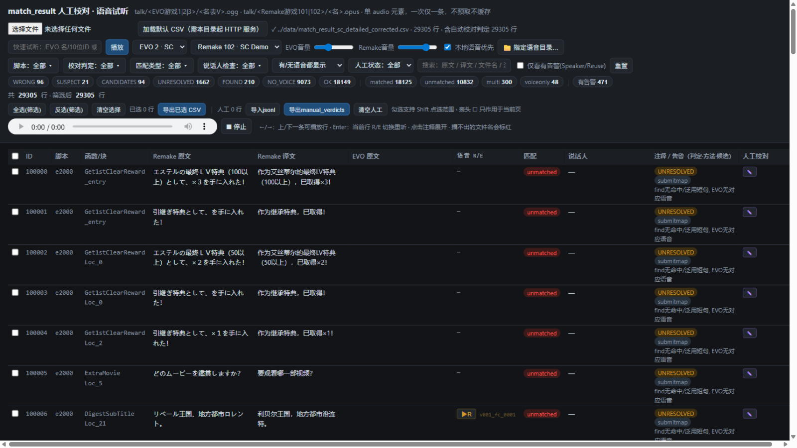
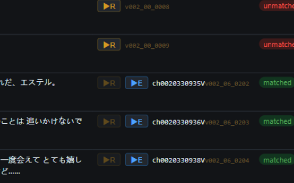
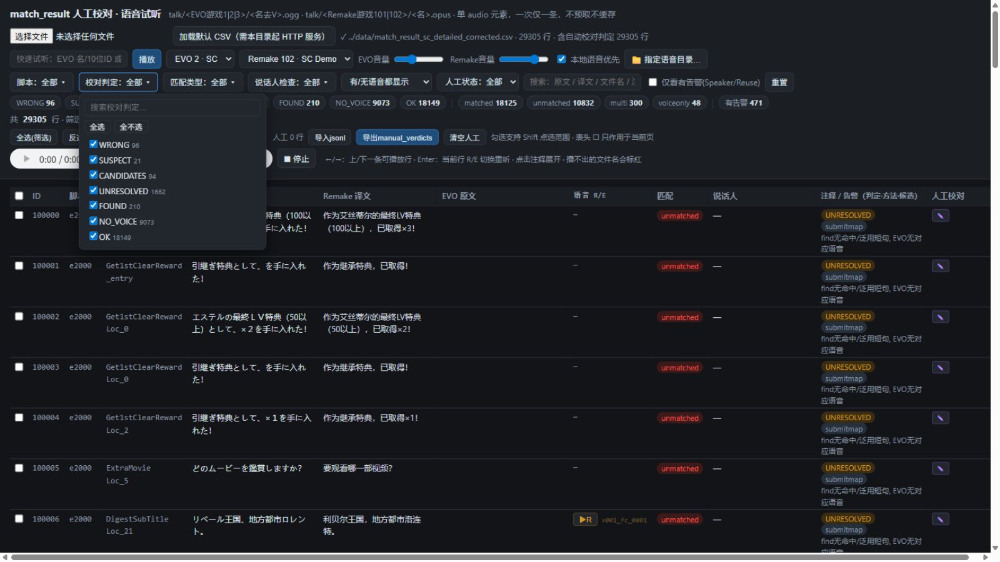
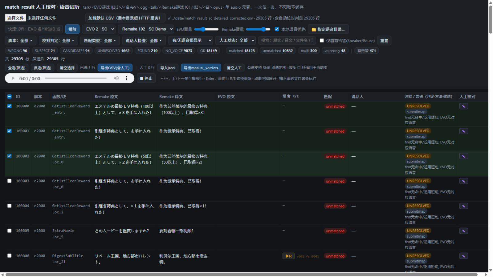
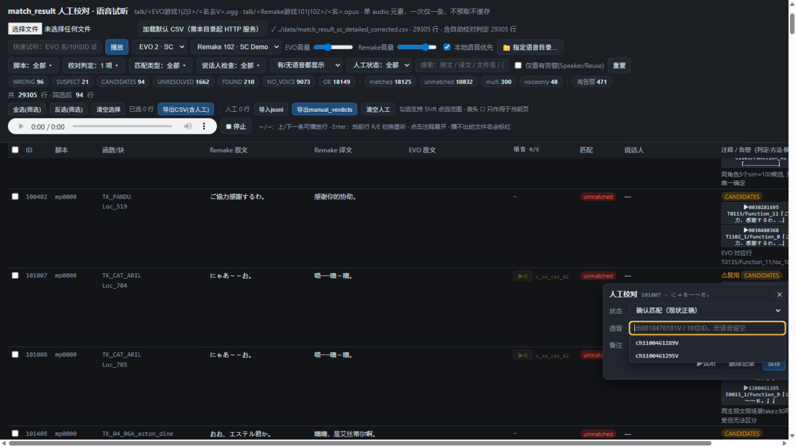

# match_result 人工复核指南 —— 语音试听检查页

`match_voice_checker.html` 是一个**零依赖的单文件网页**，用来对
`data/match_result_sc_detailed_corrected.csv`（自动校对后的匹配详表）做**逐行人工复核**：
在线/本地试听两侧语音、核对自动匹配结果、把人工裁定导出为 JSONL 供 patch 脚本应用。

在整条流水线中的位置：

```
s4 匹配 → match_result_*_detailed.csv
        → review_agent 自动校对 → apply_verdicts.py → *_detailed_corrected.csv
        → ★ 本页人工复核 → manual_verdicts_<N>.jsonl
        → （patch 脚本按 RemakeVoiceID 应用，产出最终 match result）
```

语音来源说明：页面从 [trailsinthedatabase.com](https://trailsinthedatabase.com) 的公开音频 CDN
按需加载（`talk/<游戏ID>/<文件名>`），**一次只加载一条、不预取不缓存**，对站点压力等同一名普通访客。
EVO 语音（`ch*.ogg`，文件名去掉 `V` 后缀）与 Remake 语音（`v*.opus`，SC Demo=102 / FC=101）都可以试听。

---

## 1. 启动

### 方式 A：随服务器启动（推荐，功能全）

```bash
cd SkyStructureAligner/review_agent
python voice_check_server.py            # 默认端口 8613，语音目录 G:\sc_demo_voice\voice\wav
```

浏览器打开 `http://127.0.0.1:8613/review_agent/match_voice_checker.html`，点顶部
**「加载默认 CSV」**即可（CSV 相对路径 `../data/match_result_sc_detailed_corrected.csv`）。

服务器参数（路径不必写死在代码里）：

| 参数 | 作用 | 默认 |
|------|------|------|
| `--root` | 页面与 CSV 所在根目录 | SkyStructureAligner 目录 |
| `--voice` | 本地语音目录，**可多次传入**按顺序查找 | `G:\sc_demo_voice\voice\wav` |
| `--port` | 端口 | 8613 |

例：`python voice_check_server.py --voice H:\my_voice --port 9000`

### 方式 B：file:// 直接双击打开

不起服务也行：双击 HTML → 把 CSV **拖进页面**（或用选择文件按钮）。
此方式没有「加载默认 CSV」按钮和服务器本地语音，但**网页目录选择**（下述）仍然可用。

### 方式 C：任何静态服务器

`python -m http.server` 等均可；只要页面和 CSV 能被同源访问。

---

## 2. 界面总览



自上而下：

1. **加载区**：选择/拖放 CSV、一键加载默认 CSV、加载状态。
2. **试听控制行**：快速试听输入框（接受 `ch0010470181V`、裸 10 位 ID、`v009_00_0064` 等形式）、
   EVO/Remake 两个游戏下拉（EVO 1=FC/2=SC/3=3rd；Remake 101=FC/102=SC Demo）、
   **两根独立音量滑条**（EVO 默认 0.32、Remake 默认 0.75，按所播文件属于哪侧自动套用）、
   「本地语音优先」开关、**「📁 指定语音目录…」**按钮。
3. **过滤器行**：四个**多选过滤器**（脚本/校对判定/匹配类型/说话人检查）、语音有无、人工状态、
   全文搜索、仅看有告警、重置。
4. **chips 快捷条**：按复核优先级排的判定 chips（WRONG→SUSPECT→CANDIDATES→UNRESOLVED→FOUND→NO_VOICE→OK）
   与匹配类型 chips，点一下=只看该类，再点恢复全部。
5. **多选工具栏**：行勾选的全选/反选/清空/导出，以及人工校对的计数、导入/导出 JSONL。
6. **播放条**：原生 audio 控件 + 停止按钮（释放资源）+ 当前播放指示。

---

## 3. 语音试听

每一行的「语音 R/E」列有两个按钮：

- **▶E（蓝）**：EVO 侧语音，播 `talk/<EVO游戏>/<名去V>.ogg`。CSV 里的 `ch0010470181V`
  在站上是 `ch0010470181.ogg`——页面自动处理，**输入带不带 V、带不带 ch 前缀都可以**。
- **▶R（金）**：Remake 侧语音，播 `talk/101|102/<RemakeVoiceFilename>.opus`。

### 本地语音优先（三级回退）

勾选「本地语音优先」（默认开）时，▶R 按下面顺序解析，来源显示在播放指示里：

1. **网页指定的目录**（见下）——`（本地目录）`
2. **服务器 `/localvoice/`**——`（本地）`
3. **在线 CDN**（无标注）
4. 都没有时若存在 **b 形式**本地文件（`v009_03_0063` → `v009_b0063.wav`）会回退播放，
   标注 `（本地·b形式，可能非同一take）`——b 系列是另一个录音批次，**仅供参考比对，不要直接当结论**。

**「📁 指定语音目录…」**：点击后浏览器弹出系统目录选择框，选中的文件夹里所有
wav/ogg/opus 会被建索引，之后优先从这里播放。目录会被记住（IndexedDB），下次打开页面
一键恢复授权。纯前端读取，不起服务器也能用；需 Chrome/Edge。

### 缺失与变暗

- 网站对不存在的文件也返回 HTTP 200（返回的是首页 HTML），页面靠播放器报错识别，
  播不出的文件名会**标红**。
- 网站 102（SC Demo）只收录了 **bank 00/01/fc** 三个语音库；bank ≥02 的 Remake 语音
  ▶R 按钮自动**变暗**（悬停有说明）。其中一部分能被本地拆包（b 形式）救回——
  一旦本地解析成功，该行按钮自动解除变暗。
- bank ≥02 且本地也没有的（如 `v018_04_0002` 一类），Demo 里根本没带这些语音，只能等正式版。



### 试听快捷键

| 键 | 作用 |
|----|------|
| `←` / `→` | 上/下一行**有语音**的行（自动翻页、滚动定位），进入一行默认播 EVO |
| `Enter` | 当前行两侧都有语音时，在 R/E 之间**切换重听**（对比利器） |
| 点行任意处 | 播放该行语音（勾选框/按钮除外） |
| ⏹ 停止 | 中断当前音频并释放网络与解码资源 |

> 全程**单个 `<audio>` 元素**，切换即中断上一条，绝不并发加载。

---

## 4. 过滤与导航

### 多选过滤器

脚本、校对判定、匹配类型、说话人检查四个过滤器都是**多选**：点开是带搜索框的勾选弹层，
每项带计数，「全选/全不选」一键切换，勾选即时生效，按钮显示「N 项」。



- 弹层内滚轮只滚列表自己，**不会把背后的表格滚走**（滚动穿透已处理）。
- 过滤器集合为空 = 不过滤；用「全不选」可以得到 0 行的空集（配合反选等用法）。

### 其他过滤

- **语音下拉**：EVO 有/无、Remake 有/无、两侧都有。
- **人工状态**：仅未校对 / 仅已校对 / 按 confirm·change·novoice·suspect 细分。
- **仅看有告警**：SpeakerCheck 或 VoiceReuseAlert 非空的行。
- **搜索框**：对原文/译文/文件名/函数/注释/**说话人名**做子串匹配（250ms 防抖）。
- **点列头排序**（ID、匹配列等）；分页每页 100 行。

### 说话人（R/E 双侧）

表格的「说话人 R/E」列：左半是 **Remake 侧**说话人，右半是**所配 EVO 语音**的说话人；
两侧不一致时整格标红加 ⚠；带 ⚙ 标记的行有说话人注记（悬停看全文，如"说话人动态传参""npc 前缀"）。

- **新版详表（31 列）**：直接读系统标注列——`RemakeSpeakerID`（R 侧说话码）、
  `RemakeCharacterDisplay` / `EvoCharacterDisplay`（双侧显示名覆盖）及其
  **`*Translation` 中文翻译列**、`SpeakerNote` / `EvoSpeakerNotes`（注记，进 tooltip 与搜索）。
  无需任何对齐。
- **说话人语言切换**：试听控制行的「说话人：日文/中文」下拉。中文模式优先取
  `*Translation` 列，其次 `speaker_names_t_name_zh_sc.json`（简中 table.pac 的名字表，
  经 speaker_map 反查 EVO 侧）；临时标签（如"青年の声"）无翻译时回退日文。
- **旧版详表（24 列）回退**：R 侧由页面加载 `remake_structure` 按 场景/函数/块/文本
  顺序对齐得出（离线验证 29305 行全命中，需服务器模式）。
- 角色名优先级：Display 列 > `speaker_names_t_name_sc.json`（Remake 说话码→名，1178 条）
  > speaker_map 反查 > char_names；查不到显示码。EVO 侧角色码取当前生效匹配的
  `ch` 前缀（人工改配后自动跟随）。
- **R说话人 / E说话人** 两个多选过滤器（码+名字，可搜索）；
  chips 条上还有 **「说话人不一致」** 快捷筛选（点开只看两侧角色不同的行，再点恢复）。
- **R说话人 / E说话人** 两个多选过滤器（码+名字，可搜索）；
  chips 条上还有 **「说话人不一致」** 快捷筛选（点开只看两侧角色不同的行，再点恢复）。
- 角色名来自 `char_names_sc.json`（码→名，渐进补全）：没有名字的码直接显示三位码。
  名字表用 `build_char_names.py` 续跑补齐（走站点搜索 API，默认 6 秒/次，可反复续跑）。

> **推荐的复核节奏**：先点 `SUSPECT`(21) 和 `WRONG`(96) chips 清掉最可疑的，
> 再过 `CANDIDATES`(94)，然后用「仅未校对」+ 语音=EVO有 逐行听 matched 行抽查；
> 「说话人不一致」chip 适合快速扫配音张冠李戴的行。

---

## 5. 行多选 / 反选 / 导出

用于圈选一批行（比如要交给脚本批处理的、或要整体标存疑的）：



- 每行最前有勾选列，选中行淡绿底色；勾选**不会**触发播放。
- **Shift 点选**：勾一行后 Shift 勾另一行，选中两者之间整段。
- **表头 ☐**：只对当前页全选/取消（部分选中显示半选态）。
- 工具栏：**全选(筛选)** / **反选(筛选)**（在当前筛选结果内反转）/ 清空，实时显示「已选 N 行」。
- **导出CSV(含人工)**：导出勾选的行（**未勾选则导出全部行**）。人工裁定过的行会按第 7 节规则
  应用：`MatchType` 变为 `manual(状态)`、改配/无语音相应换/清 `OldVoiceFilename`、
  Annotation 追加记录，并在表尾附加 `ManualStatus / ManualVoice / ManualNote` 三列
  （带 BOM，Excel 直开）。

---

## 6. 人工校对编辑器

点行尾 **✎** 打开编辑器（跟着按钮定位，Esc 关闭）：



### 语音选择：三种方式

1. **候选下拉**：输入框聚焦自动展开**全量候选**（当前匹配 + 注释里的自动校对候选/多候选提示，
   每项悬停可见出处脚本与文本）。选中之后仍可随意切换，不会被已选值锁死。
2. **键盘**：`↓` 展开并在候选间移动、`↑` 反向；**每切一个候选自动试听**（250ms 防抖，
   连按只播最后一条）。
3. **滚轮**：在下拉展开时，滚轮=切换候选（等同 ↑↓；有累计阈值，触摸板小步滚动不会连跳）。
4. **手输**：`ch0010470181V` / `0010470181`（裸 ID）/ `v009_00_0064` 都行，
   保存时自动归一化为 `ch…V` 标准形；打字时下拉按子串过滤。

按键约定：`Enter` 第一次=确认候选收起下拉，第二次=保存；`Esc` 先收下拉、再按才关编辑器。

### 状态自动联动（不用手动选状态）

**状态会跟着语音选择自动变**，联动瞬间旁边闪「⚡已联动」：

| 语音输入 | 状态自动变为 |
|----------|--------------|
| 与原配（该行 OldVoiceFilename）不同 | **改配** |
| 改回原配（含裸 ID 等价形式） | **确认** |
| 清空 | **无语音** |
| 手动选了「存疑」 | 保持，直到语音再次变化才重新联动 |

### 保存与持久化

- 保存后：行尾列显示状态标签 + 目标语音 + 备注，行左侧加**紫色竖条**标记。
- 记录以 **RemakeVoiceID** 为键，**翻页、筛选、排序、刷新页面都不丢**
  （存 localStorage，换 CSV 重载也还在；「清空人工」可全部删除）。

---

## 7. manual_verdicts JSONL：导出 / 导入

工具栏「导出manual_verdicts」得到 `manual_verdicts_<N>.jsonl`，一行一条：

```json
{"RemakeVoiceID":"102047","status":"change","voice":"ch0210290941V","voiceId":"0210290941",
 "prevVoice":"ch0210290940V","prevMatchType":"matched","note":"听感应为下一句","ts":"2026-09-02T14:19:28Z"}
```

| 字段 | 含义 |
|------|------|
| `RemakeVoiceID` | 行唯一键（对应详表首列），patch 按它关联 |
| `status` | `confirm` 确认现状 / `change` 改配 / `novoice` 应无语音 / `suspect` 存疑 |
| `voice` / `voiceId` | 人工裁定的 EVO 语音（标准形 `ch…V` / 裸 10 位 ID；novoice 为空串） |
| `prevVoice` / `prevMatchType` | 导出时该行的原匹配与类型（便于 diff 与回滚） |
| `note` / `ts` | 备注 / 时间戳 |

建议的 patch 应用规则：`change`→把该行 Old\* 换成 `voice`；`novoice`→清空匹配；
`confirm`→不动；`suspect`→追加标注。

> 命名提示：`review_agent/review_pack/verdicts.jsonl` 是**自动校对**的裁定文件（apply_verdicts.py
> 的输入），格式与本页导出的**人工**裁定不同，请勿混用；本页导出统一叫 `manual_verdicts_*.jsonl`。

「导入jsonl」可把之前导出的文件读回来继续校对（按 RemakeVoiceID 覆盖合并，忽略不认识的行）。

### 应用人工裁定，生成新 CSV

`apply_manual_verdicts.py` 把 JSONL 应用到 `*_detailed_corrected.csv` 上，
产出**新文件** `data/match_result_sc_detailed_manual.csv`（原表不动）：

```bash
cd SkyStructureAligner/review_agent
python apply_manual_verdicts.py                                  # 自动取 data/ 下最新的 manual_verdicts_*.jsonl
python apply_manual_verdicts.py --verdicts ../data/manual_verdicts_8.jsonl --game sc
```

应用规则（与网页端「导出CSV(含人工)」一致，脚本版额外反查 EVO 结构补全列）：

| status | MatchType | 匹配列变化 | 其他 |
|--------|-----------|------------|------|
| `change` | `manual(change)` | `OldVoiceFilename` 换为人工语音；`OldCharacterId` / `OldVoiceText` / `EvoScene` / `EvoFunction` / `EvoBlock` 从 evo_structure(+additional) 反查补全（查不到置空并记入摘要） | Annotation 追加 |
| `novoice` | `manual(novoice)` | Old\*/Evo\* 匹配列全部清空 | Annotation 追加 |
| `confirm` | `manual(confirm)` | 不动 | Annotation 追加 |
| `suspect` | 保留原类型 | 不动 | 仅 Annotation 追加 |

同时输出 `data/manual_apply_summary.json`（应用统计、change 明细、跳过原因），便于复查。

---

## 8. 快捷键速查

| 键 / 操作 | 作用 |
|-----------|------|
| `←` / `→` | 上一条/下一条有语音的行（自动播 EVO 优先） |
| `Enter` | 行内 R/E 切换重听；编辑器里=确认候选 / 保存 |
| `↑` / `↓` | 候选下拉内切换候选（自动试听） |
| 滚轮（下拉展开时） | 切换候选 |
| `Esc` | 收下拉 → 关编辑器 |
| Shift + 勾选 | 范围勾选 |
| 点行 | 播放该行 |
| 点注释文本 | 展开/收起长注释 |

## 9. 常见问题

- **某条 ▶E 报错标红**：站上确实没有这个文件（注意站上文件不带 V，页面已自动处理）。
- **▶R 变暗**：bank ≥02，站上未收录；试听会自动尝试本地（含 b 形式），仍失败则 Demo 未收录。
- **b 形式是什么**：Demo 语音包里与 bank 命名并行的 `v???_b????` 录音批次，可能与 bank 名
  不是同一 take，播放时有明确标注，仅作比对参考。
- **音量**：EVO 与 Remake 分别记忆；默认值来自站点播放器对 Sky EVO 的增益设定（0.32）。
- **刷新后人工记录还在吗**：在（localStorage）。换浏览器/换机器用导出/导入 JSONL 转移。
- **CSV 更新后**：直接重新加载即可；人工记录按 RemakeVoiceID 关联，只要 ID 不变就有效。
